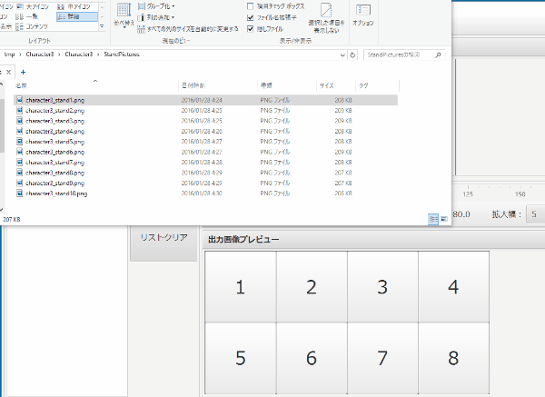

TKoolFacetileMaker2 Manual
================================================================================

- 作者             : 次郎(Jiro)
- 作成日           : 2016/07/16
- 最終更新日       : 2017/03/11
- 連絡先           : [次ログ](http://jiroron666.hatenablog.com/)
- 実行ファイル名   : TKFM.jar
- 動作確認・開発環境
  - OS             : Linux Mint 18.1
  - プロセッサ     : 2.00GHz Intel Core i7-3667U
  - メモリ         : 8GB RAM
  - Javaバージョン : 1.8.0-121

目次
--------------------------------------------------------------------------------

Software Overview
--------------------------------------------------------------------------------

  ***WARNING***

  ***I am Japanese and my English is not perfect.***

This is tool to make face tile image of RPG Maker MV and VXACE.

This helps someone to edit much stand pictures.

This tool is able to

1. connect trimmed iamges to 1 file.
1. scale up and scale down images.
1. edit images for RPG Maker MV and VXACE.

This is made by Java Programming Language.

This ought to work in Windows, Mac and Linux OS.

But I don't have Mac OS.
It means I couldn't check to work in that.

File Configuration
--------------------------------------------------------------------------------

Operation Condition
--------------------------------------------------------------------------------

Your PC has Java if you want to work this tool.

You should install Java with the following steps if you did not yet.

[Java Download](https://www.java.com/ja/download/help/download_options.xml)

Please tell me your BUG to Author Blog if you found one after you done that.

Execution
--------------------------------------------------------------------------------

Double click 'tkfm.jar'.
You should type 'java -jar tkfm.jar' if you use LinuxOS.

Usage
--------------------------------------------------------------------------------

1. Open image files that you want to connect to 1 file.
   You should click 'File' Menu and 'Open...'
   or drag and drop image files to file list.

2. Click file or select files of file list.
   Image Viewer display image that you selected when you did that.

3. Move grid panel with Mouse drag.
   Grid panel sets position to trim images.

4. Change scale of image with scroll bar of Image Viewer.

5. Click 'Insert all images'.
   Output Preview display preview image.

   'Insert all images' button sets selected images to 1 to 8 panels of Output 
   Preview.

   You should type number key (1 to 8) if you want to set images to number panel 
   of Output Preview (but not 1 panel).

6. Click 'File' Menu.
   and click 'Save' or 'Save as ...'.

   You should confirm created image.
   Work has done if no problems.

   Good job :)

ショートカットキー
--------------------------------------------------------------------------------

    W：プレビューの画像を上にずらす。
    A：プレビューの画像を左にずらす。
    S：プレビューの画像を下にずらす。
    D：プレビューの画像を右にずらす。
    
    Q：プレビューの画像を縮小。
    E：プレビューの画像を拡大。
    
    1：プレビューパネルの1番からファイルを一括挿入する。
    2：プレビューパネルの2番からファイルを一括挿入する。
    3：プレビューパネルの3番からファイルを一括挿入する。
    4：プレビューパネルの4番からファイルを一括挿入する。
    5：プレビューパネルの5番からファイルを一括挿入する。
    6：プレビューパネルの6番からファイルを一括挿入する。
    7：プレビューパネルの7番からファイルを一括挿入する。
    8：プレビューパネルの8番からファイルを一括挿入する。

注意点・不具合など
--------------------------------------------------------------------------------

- Javaをインストールしていない環境では動作しないと思います。そういった場合は
  Javaのインストール手順に従って、本ツールのバージョン以上のも のを使用してくだ
  さい。

- ファイル破損などが起きないよう慎重にデバッグを行っておりますが、個人製作とい
  うこともあり、確認がいたっていない部分も多いと思います。ファイルを扱う際はな
  るべく上書き保存などはしないで、バックアップをとって利用 してください。また、
  バグが確認されたら製作者ブログ、またはツクマテコミュニティの配布ページ で報告
  をしていただけると助かります。

利用規約
--------------------------------------------------------------------------------

- 配布している素材を利用したことで発生した問題に対して、私は一切の責任を負いま
  せん。
- 著作権は私(次郎)が有しています。私が死亡して５０年経過するまで決して放棄する
  ことはありません。
- 再配布はお控えください。
- 利用規約を事前連絡なしに変更する場合があります。その場合は最新の規約が適用さ
  れるものとします。

### 補足

- 利用できる作品
  - ツクール用に作成しましたがツクール作品以外の素材作成が目的でも利用可能で
    す。
  - 有償作品、エロゲー、グロゲーでも利用可能です。
  - ゲーム作品以外でも利用可能です。

- 利用報告
  - READMEへの記載はしなくても結構です。
  - 使用報告もしなくて結構です。

その他・作者からのお願い
--------------------------------------------------------------------------------

バグの報告は【連絡先】の製作者ブログか、ツクマテコミュニティのツール配布のペー
ジでお願いします。

新しい機能の実装のご要望をいただいた場合、実装する場合もある
かもしれませんが、必ずではないことをご了承ください。

アンインストール方法
--------------------------------------------------------------------------------

本ソフトはレジストリを変更していませんので、配布時のフォルダごとゴミ箱にぶち込
んでいただければアンインストールできます。

もし本ソフトの実行ファイルをフォルダの外に移動した実行した場合は、自動で生成さ
れる各種フォルダを削除していただければ、アンインストールは完了です。

更新履歴
--------------------------------------------------------------------------------

2017/03/11: Ver2.1.1
- 英語版の作成 (Making English Version)
